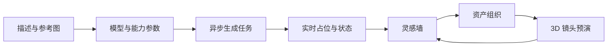
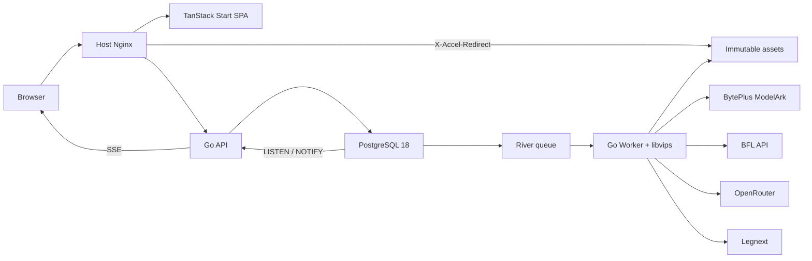

<p align="center">
  
</p>

<h1 align="center">Cornfield</h1>

<p align="center">
  <strong>让灵感从一段描述，走向一张图，再抵达一个完整镜头。</strong>
</p>

<p align="center">
  面向创作团队的私有 AI 视觉工作台，统一承载多模型生成、灵感管理与 3D 分镜预演。
</p>

<p align="center">
  <a href="https://github.com/yangliu05418-spec/Cornfield/actions/workflows/ci.yml"></a>
  <a href="https://github.com/yangliu05418-spec/Cornfield/releases"></a>
  
  
  
</p>

---

## 为什么是 Cornfield

传统 AI 图片工具解决的是“生成一张图”，Cornfield 关注的是完整的视觉创作流：选择合适的模型与参数，持续抽卡和比较结果，沉淀可检索的素材，再进入 3D 导演台完成构图、机位与镜头预演。

它不是 API 中转站，也不包含积分、支付或社区系统。Cornfield 使用团队自有的 Provider 凭据，把体验、资产和任务状态留在可控的私有环境中。

## 核心能力

| 能力 | 体验 |
| --- | --- |
| **统一多模型创作** | 在同一生成器中使用 Legnext、OpenRouter、Black Forest Labs 与 BytePlus，按模型能力动态展示比例、分辨率、画质、提示词优化和参考图选项。 |
| **实时灵感墙** | 生成后立即出现原位占位，通过 SSE 更新状态；justified rows、行级虚拟化和多档缩放让大规模图片浏览仍然流畅。 |
| **渐进式图片交付** | 320 / 640 缩略图与模糊占位先于成功事件准备，1280 异步补齐，避免新图片首屏直接加载高分辨率原图。 |
| **资产组织** | 支持搜索、文件夹、归档、批量移动与永久删除；创作流与资产管理共享同一份可靠数据。 |
| **确定性 Prompt Refiner** | 用户主动检查长度、非法结构与风险词组，逐项确认、可撤销；规则引擎不调用 LLM，不产生额外 Token 成本。 |
| **3D 导演台** | 管理云端导演台项目，在浏览器中摆放角色、道具、灯光与机位；截图可直接置入灵感墙，继续进入生成工作流。 |

## 创作链路



- 生成器在任务提交后保持可编辑，创作无需等待上一批结束。
- Midjourney 一次 draw 对应四张结果，并保持输出顺序稳定。
- 新图片不会抢夺用户当前滚动位置；离开顶部时以“新图片”提示承接更新。
- 失败项提供中文、可行动反馈，可隐藏、编辑参数或在安全条件下重试。
- 文生图与图生图共享统一任务协议，刷新、断线和 Worker 重启后都能恢复状态。

## 技术架构



| 层级 | 选型 |
| --- | --- |
| Web | TanStack Start SPA、React 19、TypeScript、TanStack Query / Router / Virtual、Tailwind CSS 4 |
| 3D | React Three Fiber、Three.js、Zustand；以同源子应用按需加载，不进入主应用首包 |
| API | Go 1.26、`net/http`、pgx；纯 Go 镜像，不执行生成或图片处理 |
| Worker | Go、River、libvips；公平调度、Provider Adapter、轮询对账、下载与缩略图处理 |
| Data | PostgreSQL 18 作为业务真相、任务队列与可靠事件源 |
| Storage | 本地不可变内容寻址存储、SHA-256 去重、原子写入、Nginx 授权直出 |
| Delivery | Docker Compose、宿主机 Nginx、digest 固定的 ARM64 OCI 镜像 |

系统有意保持四个核心常驻服务：`web`、`api`、`worker`、`postgres`。没有 Redis、Kafka、MinIO 或 Node.js 生产运行时。

## 稳定性设计

- **成本安全优先**：上游提交结果不确定时进入 `submission_uncertain`，不自动重提，避免重复计费。
- **状态可恢复**：业务状态、Provider attempt 与事件持久化；通知只负责唤醒，不承担事实存储。
- **隔离故障域**：API 不做长耗时任务，Worker 独立执行生成、轮询、下载、校验和缩略图处理。
- **上游保护**：Provider 级并发限制、分类重试、熔断、健康探针与自动恢复。
- **安全交付**：文件型 Secret、最小权限数据库角色、CSRF、Argon2id、受保护资产路径和默认关闭的公网数据库端口。
- **可观测发布**：Mock Provider CI、真实 Provider canary、SBOM、provenance、漏洞扫描与 digest 固定发布。

## 快速验证

### 环境要求

- Go 1.26+
- Node.js 20+
- pnpm 11+
- Docker Engine 与 Docker Compose v2（完整集成验证）

### 克隆与检查

```bash
git clone https://github.com/yangliu05418-spec/Cornfield.git
cd Cornfield

# Go API / Worker / tools
cd backend
go test ./...
go vet ./...
go run ./cmd/modelctl validate

# Cornfield Web
cd ../web
pnpm install --frozen-lockfile
pnpm check
pnpm typecheck
pnpm lint
pnpm test
pnpm build

# 3D 导演台
cd ../3d-director-desk-main
npm ci
npm test
npm run build:embedded
```

完整 CI 还会执行 race detector、静态检查、浏览器 E2E、生产镜像构建，以及基于全新 PostgreSQL 和 Mock Provider 的 Compose smoke。Mock smoke 不消耗真实 Provider 额度。

> 生产环境故意不提供“带默认密码的一键启动”。数据库角色、Provider Key、内部签名 Secret、TLS、目录权限和不可变镜像必须在部署前显式配置。

## 目录结构

```text
backend/                  Go API、Worker、迁移、任务与 Provider Adapter
web/                      Cornfield SPA、灵感墙、资产与管理界面
3d-director-desk-main/    按需加载的 3D 导演台子应用
config/                   版本化模型能力配置
docs/                     运维与模型能力文档
ops/                      Nginx、监控、发布与验证脚本
product-spec-v1/          产品、信息架构与统一任务协议基线
```

## 文档

- [模型能力与真实参数边界](docs/MODEL_CAPABILITIES.md)
- [生产部署、发布、回滚与故障处理](docs/OPERATIONS.md)
- [负载测试](ops/load/README.md)
- [产品与统一任务协议](product-spec-v1/README.md)
- [第三方组件与词典声明](THIRD_PARTY_NOTICES.md)

## 协作约定

1. 从 `main` 创建短生命周期分支。
2. 每个提交只解决一个清晰问题，避免跨域重构。
3. 模型能力变化必须先更新配置、校验并通过真实 canary，不在运行时自动猜测。
4. 任何 Secret、Prompt 原文、图片正文和本地绝对路径都不得进入 Git 或日志。
5. PR 合并前必须通过与改动范围相匹配的测试。

## 使用范围

Cornfield 当前定位为团队内部创作基础设施，不包含公开注册、计费、积分、支付或社区能力。项目未声明为开源软件；第三方组件和素材的许可信息以 [THIRD_PARTY_NOTICES.md](THIRD_PARTY_NOTICES.md) 及各子目录声明为准。
