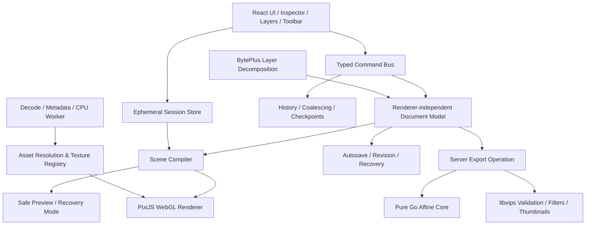

# Cornfield 专业图片工作台：长期产品与技术架构

> 状态：Architecture Baseline 1.0<br>
> 适用范围：Cornfield 图片工作台、智能分层、非破坏性编辑与发布链路<br>
> 基线：`main@3b4131c`；现有文档协议 `schema_version=1`

## 1. 产品定位

Cornfield 图片工作台不是一个“给生成图片加几个变换按钮”的轻量组件，而是 AI 图片从生成结果走向可控成片的专业编辑环境。长期目标是达到 Photoshop 级别的核心可用度：操作精确、结果可预测、编辑非破坏、工程可恢复，大图与多图层下仍保持稳定响应。

“Photoshop 级”在 Cornfield 中优先指以下体验标准，而不是一次性复刻 Photoshop 的全部历史能力：

- 用户可以用标准的图层、组、蒙版、混合模式、调整层和智能对象组织画面。
- 移动、缩放、旋转、裁切、绘制和调参均实时反馈，拖拽过程不触发 React 页面重渲染。
- 每次操作可撤销、可恢复；自动保存、冲突和异常退出不会静默丢失工程。
- 预览与最终导出语义一致，服务端导出不依赖浏览器是否仍然在线。
- AI 分层、生成式编辑和普通手工编辑共享同一文档模型，而不是各自形成孤岛。

暂不承诺的能力包括 CMYK 印前全流程、RAW 显影、视频时间线、3D、第三方插件生态及完整 PSD 私有特性兼容。它们属于后续产品线决策，不能污染当前内核边界。

## 2. 当前基线与结构性差距

### 已具备

- 独立沉浸式工作台、灵感墙编辑入口和返回锚点。
- 平移、缩放、旋转、翻转、裁切、透明度、显隐、锁定、层级排序。
- 多选、框选、吸附、对齐、分布、复制、上传、撤销与重做。
- 1 秒防抖自动保存、revision 乐观锁、冲突与 422 停止重试。
- 服务端纯 Go 仿射合成，单并发 `RenderSem`，36MP、64对象边界。
- BytePlus 智能分层、可靠 operation、SSE、发布、单层导出和 ZIP。
- 320/640/blur 发布门槛、1280 异步补齐、不可变资产和删除生命周期。

### 必须先解决的结构问题

1. 前端编辑路由约 3,273 行，交互、状态、网络、画布、历史和 UI 同处一个文件，继续增加工具会产生连锁回归。
2. 画布依赖 DOM/CSS 图片节点，适合几十个简单位图对象，不适合滤镜链、蒙版、画笔、混合模式和大规模纹理管理。
3. `schema_version=1` 只有平面位图对象与 `z_index`，无法表达组、文字、形状、蒙版、调整层和智能对象。
4. 历史记录通过完整 `structuredClone` 文档保存；对象和参数增长后，拖拽历史会放大内存与 GC 抖动。
5. 前端预览与服务端导出尚无正式“渲染语义协议”；新增混合模式或滤镜时容易产生肉眼可见的不一致。
6. 资源加载没有显式 CPU/GPU 内存预算、分辨率梯度、纹理淘汰策略和 WebGL context loss 恢复协议。

结论：下一阶段首先建设编辑器平台层，不在现有路由中直接追加专业工具。

## 3. 体验原则

### 专业而不晦涩

- 工具与快捷键遵循主流图像软件心智：`V` 移动、`M` 选区、`C` 裁切、`B` 画笔、`T` 文字、`H/Space` 平移。
- 高频操作就地完成，低频参数进入右侧属性面板；禁止用连续弹窗打断创作。
- 画布只展示创作结果与必要控制柄，系统状态使用边缘状态区表达。
- 高风险或不可逆操作有明确确认；非破坏性操作默认无需确认。

### 精确、连续、可恢复

- Pointer move 只更新渲染内核的瞬时状态；pointer up 后合并为一条可撤销命令。
- 所有数值属性可以键盘微调、直接输入和恢复默认值。
- 保存状态明确区分“已保存 / 正在保存 / 离线待同步 / 存在冲突”。
- GPU 丢失、资源解码失败、标签页崩溃和网络中断均有恢复路径，不以刷新页面作为正常方案。

### Cornfield 视觉语言

- 继续使用 `#0f1113` 画布、`#1c1e20` 表面、`#2e3031` 边线和 lime 主强调色。
- lime 只承担当前工具、主操作、选中状态和精确对齐反馈，不作为大面积装饰。
- 动效只解释状态变化：面板切换、图层重排、异步处理和错误恢复；文档几何不能由 UI 动画驱动。
- `prefers-reduced-motion` 下关闭位移和粒子效果，保留必要的透明度反馈。

## 4. 总体架构



核心规则：文档、命令和资产是业务真相；PixiJS 只是一个可替换的渲染后端，React 也不持有每帧变化的画布真相。

## 5. 前端技术决策

### 渲染内核：PixiJS v8，WebGL2 优先

采用 PixiJS v8 的命令式 API，不采用 `@pixi/react` 作为画布状态层。

选择理由：

- 提供稳定的 WebGL/WebGL2 渲染器、场景树、RenderTexture、滤镜、混合模式和纹理生命周期。
- RenderGroup、纹理 GC、资源后台加载和显式 unload 能形成可度量的资源治理。
- 可通过扩展和自定义 shader 增加专业滤镜，而不需要从原生 WebGL 管线开始建设。
- WebGPU 保留在 renderer adapter 后作为实验后端；生产默认 WebGL。Pixi 官方当前也建议生产使用 WebGL，WebGPU仍受浏览器实现差异影响。

不选择：

- **OGL**：适合小型定制 WebGL 场景，但选择、场景缓存、滤镜调度、纹理治理和可访问控制都要自行实现，长期维护成本过高。
- **Fabric.js**：交互能力成熟，但序列化模型与 Fabric 对象强耦合，难以保持 Go 服务端、AI 分层与未来多渲染后端的一致语义。
- **Konva**：比 DOM 画布更强，但专业滤镜、GPU管线和超大图资源管理的上限低于 PixiJS。
- **GSAP / anime.js**：不进入文档与画布内核。工作台 UI 的短动效继续使用 CSS；只有未来出现复杂教程时间线时再单独评估 GSAP。

### 状态与命令

拆分三类状态：

1. **持久文档状态**：画布、节点树、效果和资产引用，可序列化、可校验、可服务端导出。
2. **会话状态**：选区、当前工具、hover、控制柄、viewport、临时拖拽，不写入工程文档。
3. **远端状态**：工程 revision、保存状态、operation 与资产，通过 TanStack Query 管理。

引入一个小型、强类型的 editor store，优先采用 Zustand vanilla store 配合 `useSyncExternalStore`。它只管理会话和文档引用，不让业务类型依赖 Zustand。所有文档修改必须经过 `Command`：

```ts
interface EditorCommand {
  id: string
  label: string
  apply(document: EditorDocumentV2): EditorDocumentV2
  invert(before: EditorDocumentV2): EditorCommand
  merge?(next: EditorCommand): EditorCommand | null
}
```

- 连续拖拽、滑杆和键盘连按按 interaction ID 合并为一条历史。
- 历史保存命令与逆命令，不保存 100 份完整 JSON。
- 每 20 条命令或 30 秒创建内存 checkpoint，加快长历史回放。
- 自动保存提交规范化文档快照，不直接持久化前端内部命令对象。
- 暂不引入 Yjs；当前没有多人实时协作需求，不能提前承担 CRDT 复杂度。

### Worker 与主线程边界

- 主线程：输入采样、控制柄、轻量矩阵计算、Pixi scene mutation 和 UI。
- Decode Worker：`createImageBitmap`、图片方向、元数据、预览级缩放和可取消预取。
- 可选 Render Worker：仅在 Pixi/WebGL OffscreenCanvas Spike 证明兼容性和收益后启用。
- 所有跨线程大数据使用 transferable `ImageBitmap/ArrayBuffer/OffscreenCanvas`，禁止复制完整像素数组。

浏览器的 OffscreenCanvas 和 ImageBitmap 已能在 Worker 使用，但不能把它当作全浏览器零差异能力；首版 GPU 内核保持主线程渲染，重解码和 CPU 任务先移出主线程。

## 6. 文档协议 V2

V2 采用与渲染器无关的有类型节点树，不直接保存 Pixi/Fabric 对象：

```ts
type EditorNode =
  | RasterNode
  | GroupNode
  | TextNode
  | ShapeNode
  | AdjustmentNode
  | SmartObjectNode

interface BaseNode {
  id: string
  type: string
  name: string
  parent_id: string | null
  order_key: string
  transform: [number, number, number, number, number, number]
  opacity: number
  blend_mode: BlendMode
  visible: boolean
  locked: boolean
  mask_id?: string
}

interface RasterNode extends BaseNode {
  type: 'raster'
  asset_id: string
  crop?: NormalizedRect
  effects: EffectDescriptor[]
}
```

协议约束：

- `schema_version` 与 `renderer_semantics_version` 分离。前者表示结构，后者锁定像素语义。
- 图层顺序使用节点树与稳定 `order_key`，不再要求全局连续 `z_index`。
- 组、蒙版、调整层均是一等节点或独立资源，不把效果烘焙进原图。
- 效果使用白名单 operation graph；每个效果有版本、参数范围和颜色空间语义。
- 资产只通过 UUID 引用；禁止 URL、Base64 和 renderer 私有对象进入文档。
- V2 初始边界建议为 2MiB、500节点、32层嵌套；按真实性能数据调整，不用无限制换取表面兼容。

### V1 兼容迁移

- API 继续接受 V1；读取时通过纯函数映射为 V2 的平面 raster 节点树。
- 旧工程只有在用户第一次成功保存 V2 时升级，数据库保留上一个有效 revision 用于恢复。
- Worker 在迁移窗口同时支持 V1/V2，不允许先发布只会写 V2 的 Web。
- 每个新节点和效果必须先具备服务端校验与导出语义，再对 UI 开放。
- schema migration 使用 golden JSON、向前读取测试和 round-trip 测试，禁止就地字符串重写。

## 7. 渲染与导出一致性

### 客户端预览

- Pixi scene compiler 将 V2 节点树编译为 retained scene；文档 revision 未变化时复用节点和纹理。
- 选择框、参考线、控制柄和套索使用独立 overlay 层，不参与最终导出。
- 视口缩放与文档 transform 分离；缩放画布不会写 document。
- 滤镜按 operation graph 编译，静态子树可按需缓存为 RenderTexture，但不得缓存超过设备纹理上限的整幅超大画布。

### 服务端权威导出

- 现有纯 Go 仿射、裁切、透明度和层级合成继续作为稳定核心。
- libvips继续负责解码校验、缩略图、blur；后续用于能够证明像素语义的颜色调整、蒙版与滤镜执行。
- 新增 `ExportCompiler`，把 V2 节点树编译为受限服务端 operation graph；HTTP handler 不直接拼 libvips 操作。
- 浏览器“快速预览导出”不能替代服务端正式发布。
- 每种效果都有浏览器 golden、服务端 golden 和像素差异阈值；超过阈值即不能发布该效果。

### 色彩管理

- 第一阶段显式锁定 sRGB，上传时记录原 ICC/EXIF，显示层做统一转换，不让浏览器和服务端各自猜测。
- Display-P3 作为独立 capability，在 WebGL `drawingBufferColorSpace/unpackColorSpace`、浏览器覆盖率和服务端导出链通过验证后开放。
- 在 P3 开放前，UI 明确提示工程输出为 sRGB；不伪装成全色彩管理产品。

## 8. 大图与资源性能架构

### 分辨率梯度

每个资产提供与编辑缩放相关的分辨率层级：320、640、1280、2048、原图。纹理选择遵循“屏幕像素密度 × 当前缩放”，而不是默认上传原图到 GPU。

- 移动或缩放过程中允许使用低一级纹理。
- 交互停止 120–180ms 后升级到满足当前视口的纹理。
- 原图只在高倍局部查看、画笔或精确导出前加载。
- 同一 SHA 共享纹理源和引用计数。

### 内存预算

- 通过设备内存、最大纹理尺寸和实测能力选择 `low/standard/high` GPU档。
- 默认 GPU 预算从 256MiB 起，桌面高性能档最多 512MiB；超预算使用 LRU 卸载不可见纹理。
- CPU 解码缓存独立计量，ImageBitmap 用完显式 `close()`。
- 项目切换、图层删除和 context loss 后显式销毁 Pixi节点、RenderTexture和纹理引用。
- 监听 `webglcontextlost/restored`，暂停编辑、保留文档与命令，重建场景后恢复，而不是让用户丢失工作。

### 超大画布

- 36MP 继续作为当前稳定基线；先完成 100层与36MP组合性能，再提升像素上限。
- 超过单纹理安全上限的资产使用 tile pyramid；视口只加载可见 tile 与一圈预取。
- 调整层和组缓存按 tile 失效，不因局部修改重算完整画布。
- 100MP能力以服务端 tile/导出和低端设备降级均通过为发布条件。

## 9. 专业功能体系

### 组合与组织

- 图层组、嵌套组、搜索、颜色标签、多选、链接图层。
- 常用混合模式：Normal、Multiply、Screen、Overlay、Darken、Lighten。
- 图层蒙版、剪贴蒙版、锁定透明像素。
- 智能对象：原始资产不可变，变换和效果非破坏保存。

### 精确编辑

- 像素/百分比/角度输入、参考点选择、标尺、参考线、网格、智能吸附。
- 非破坏裁切、画布尺寸、图像尺寸、旋转与翻转。
- 可变 feather 的矩形/椭圆/套索选区，选区可保存为蒙版。
- 画笔、橡皮擦本质上修改 raster mask 或新 raster node，不直接破坏源资产。

### 文字、形状与颜色

- 点文字、区域文字、字体加载状态、对齐、字距、行距和文字样式。
- 矩形、椭圆、线、路径和填充/描边。
- 非破坏调整层：曝光、对比度、色温、色相/饱和度、曲线、色阶。
- 直方图和取色器放在异步采样 Worker，不阻塞 pointer 交互。

### AI 原生能力

- 智能分层继续作为“从位图到可编辑节点树”的入口。
- 后续生成式填充、扩图、移除和局部重绘以 selection/mask + operation 形式进入，不建立独立页面。
- AI 结果先作为候选版本或新图层，不静默覆盖用户当前节点。
- 所有模糊提交继续遵循“不自动重新付费提交”。

## 10. 模块边界与目录目标

```text
web/src/features/editor/
  domain/            # V2 types, validation, migration, commands
  store/             # session store, history, autosave coordinator
  renderer/          # adapter, Pixi implementation, scene compiler
  resources/         # decode worker, texture registry, memory budget
  tools/             # move, crop, selection, brush, text
  panels/            # layers, properties, history, export
  operations/        # decomposition, publish, SSE reconciliation
  testing/           # fixtures, perf scenes, golden helpers
```

路由文件只负责加载工程、安装编辑器 shell 和离开保护，目标控制在 250 行以内。工具之间不直接 import React panel；工具输出命令，panel订阅 store。

后端对应拆分：

```text
backend/internal/editor/
  document/          # V1/V2 decode, validate, migrate
  operations/        # renderer-independent operation graph
  render/            # pure Go core and export compiler
  lifecycle/         # assets, projects, revisions, cleanup
```

## 11. 可量化性能与可靠性门槛

| 场景 | 发布门槛 |
|---|---|
| 工具输入到首帧反馈 | p95 < 16ms |
| 拖拽/缩放/旋转 | 目标 60fps，p95 long task < 50ms |
| 4K、50图层打开可操作 | < 2.5s（暖缓存 < 1.5s） |
| 36MP、100图层平移缩放 | 无 OOM，交互 p95 >= 45fps |
| 自动保存 | p95 < 250ms，失败不丢本地待保存状态 |
| DB事件到UI | p95 < 1s |
| 正式导出 | 只有一次operation；崩溃恢复不重复生成/付费 |
| GPU context loss | 10s内恢复场景或进入安全恢复模式 |
| 内存 | 离开项目后5分钟内回落到基线+20%以内 |

性能数据按低、中、高三档设备记录，不能只在开发机验收。

## 12. 测试体系

- **领域测试**：schema迁移、命令 apply/invert/merge、矩阵性质、非法文档和资源越权。
- **跨渲染 golden**：浏览器 Pixi、纯 Go 和 libvips导出的统一 fixture；对边缘抗锯齿使用容差与感知差异，不使用脆弱的逐字节等同。
- **交互测试**：Playwright真实 pointer、键盘、触控、缩放、选择、拖动、失焦和返回恢复。
- **性能场景**：10/50/100/500节点，4K/8K/36MP，不同混合模式、蒙版和滤镜组合。
- **故障测试**：WebGL context loss、Worker终止、纹理解码失败、离线、409、422、SSE reset和标签页崩溃。
- **内存测试**：反复打开/关闭项目、切换原图、多次撤销和AI结果替换，检测 DOM、ImageBitmap、纹理和Worker泄漏。
- **安全测试**：文档炸弹、恶意字体/图片、跨用户资产ID、shader/effect白名单、ZIP与派生资产生命周期。

## 13. 开发路线

### Stage A：编辑器平台化（4–6周）

- 把现有路由拆为 domain/store/renderer/tools/panels/operations。
- 建立 renderer adapter、命令系统、历史合并和可恢复autosave。
- 完成 Pixi WebGL Spike：现有全部 V1 行为、50图层、36MP和context loss。
- V1 DOM renderer保持可回滚；Spike未过门槛不替换生产渲染器。

### Stage B：专业组合能力（6–8周）

- V2协议、组、混合模式、蒙版、剪贴、智能对象和稳定图层树。
- 服务端 ExportCompiler 与跨渲染 golden。
- 标尺、参考线、网格、数值变换和专业快捷键体系。

### Stage C：文字、形状与非破坏调色（6–9周）

- 文字与字体治理、矢量形状、基础路径。
- 调整层、滤镜链、直方图和取色器。
- sRGB完整链路；Display-P3技术预研与能力门。

### Stage D：选区与像素级修饰（8–12周）

- 选区、羽化、画笔、蒙版绘制、橡皮擦、修复工具。
- tile pyramid、局部失效和100MP工程路径。
- 画笔延迟、压力输入和大笔刷性能专项。

### Stage E：AI编辑与互操作（持续迭代）

- 生成式填充、扩图、局部重绘、版本候选和可追溯operation。
- PSD导入/导出技术验证；只在兼容矩阵明确后公开支持。
- 项目版本、模板和可审计的跨资产复用。

每个 Stage 都是可上线、可回滚的专业增量，不以“先做一个不能长期维护的 MVP”换取速度。

## 14. 第一阶段决策门

在引入 PixiJS 到生产前，使用同一组 fixture 对 DOM、Pixi WebGL 和服务端进行 Spike：

1. 50个4K图层、36MP画布下平移/缩放/旋转达到性能门槛。
2. 裁切、透明度、翻转、层序与服务端导出在容差内一致。
3. 纹理预算生效，项目切换后内存回收通过。
4. 强制触发 WebGL context loss 后工程与选择状态可恢复。
5. 低端或禁用 WebGL 环境进入明确的安全恢复模式，不损坏工程。
6. 现有智能分层、保存、发布和SSE链路零语义回归。

只有全部通过才把 Pixi renderer 设为默认。失败项必须修复或形成显式降级，不通过“在高配开发机看起来流畅”替代验收。

## 15. 依赖治理

- 新运行时依赖必须固定版本、通过许可证和漏洞扫描，并说明删除路径。
- PixiJS只从路由级动态 chunk加载，不进入创作页首包。
- 不同时引入两套画布库或两套动画库。
- 自定义 shader必须有输入范围、资源上限和服务端语义；不能执行用户提供的 shader。
- 依赖升级先跑 golden、性能和context-loss测试，再进入常规前端测试。

## 16. 已参考的官方技术依据

- [PixiJS Renderers](https://pixijs.com/8.x/guides/components/renderers)
- [PixiJS Assets](https://pixijs.com/8.x/guides/components/assets)
- [PixiJS Garbage Collection](https://pixijs.com/8.x/guides/concepts/garbage-collection)
- [PixiJS Render Groups](https://pixijs.com/8.x/guides/concepts/render-groups)
- [PixiJS Performance Tips](https://pixijs.com/8.x/guides/concepts/performance-tips)
- [MDN OffscreenCanvas](https://developer.mozilla.org/en-US/docs/Web/API/OffscreenCanvas)
- [MDN Worker createImageBitmap](https://developer.mozilla.org/en-US/docs/Web/API/WorkerGlobalScope/createImageBitmap)
- [MDN WebGL context lost](https://developer.mozilla.org/en-US/docs/Web/API/HTMLCanvasElement/webglcontextlost_event)
- [MDN WebGL drawing buffer color space](https://developer.mozilla.org/en-US/docs/Web/API/WebGL2RenderingContext/drawingBufferColorSpace)
