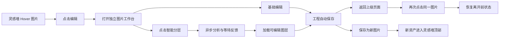

# Cornfield 图片工作台与智能分层 PRD

> 文档状态：Implementation baseline v1.0  
> 日期：2026-08-13  
> 产品名称：图片工作台（能力：智能分层）  
> 上游能力：BytePlus ModelArk / `dola-seedream-5-0-pro-260628`

## 1. 产品结论

本次不把“智能分层”设计成图片上的一次性操作，而是将其纳入一个可持续恢复的图片编辑工作台。

用户在灵感墙或资产页将光标移到图片上，点击新增的“编辑”按钮，即进入独立页面。工作台首先以单层方式打开原图，用户可直接完成基础图形编辑；只有在需要拆解画面时，才主动点击“智能分层”。系统以默认参数一键提交，等待期间通过真实状态、阶段文案和克制动效降低等待感。用户可以随时返回，任务继续执行，编辑工程自动保存；再次点击同一图片时恢复上次离开的状态。

核心产品原则：

- **先进入编辑，再按需使用 AI**：不在入口弹窗中让用户先理解模型参数。
- **工程与图片分离**：编辑状态自动保存；原始资产保持不可变。
- **异步但不中断**：分层任务允许离开页面，重新进入后继续显示真实状态。
- **不伪造进度**：上游不支持流式进度，前端只展示阶段提示和已耗时，不展示虚假百分比。
- **发布由用户决定**：只有“保存为新图片”才生成新资产并进入灵感墙顶部。

Cornfield 现有 Go、River、PostgreSQL、SSE、本地资产存储、React 与 TanStack 技术栈可以直接承载该能力，不新增容器、Python 服务、Redis 或对象存储。

## 2. 官方能力基线

该能力属于 **Seedream 5.0 Pro 图片模型**，不是 Seedance 视频模型。

| 项目 | 已确认约束 |
|---|---|
| Endpoint | `POST https://ark.ap-southeast.bytepluses.com/api/v3/images/generations` |
| Model | `dola-seedream-5-0-pro-260628` |
| 开关 | `layer_decomposition: true` |
| 输入 | 必须且只能输入一张图片；Prompt 可选 |
| 输出 | 一张底图（`z_index=0`）与最多 16 个透明图层 |
| 图层格式 | PNG，带 Alpha 通道 |
| 元数据 | `z_index`、绝对/归一化 `bounding_box`、`name`、`description` |
| 分辨率 | `auto`、`1K`、`1.5K`、`2K`；默认 `auto` |
| 输入限制 | PNG/JPEG，最大 30MB、36MP，比例 1:16–16:1 |
| 返回方式 | URL 或 Base64；URL 24 小时失效 |
| 流式 | 不支持 |
| 部分成功 | 不支持；任一图层失败则整次失败 |
| 计费 | 底图和每个图层分别按实际像素档位计费 |
| 配额 | 每次预扣 17 IPM，完成后按实际输出返还未使用部分 |

标准请求：

```json
{
  "model": "dola-seedream-5-0-pro-260628",
  "image": "data:image/png;base64,...",
  "prompt": "分离人物、标题文字和右下角装饰图形",
  "size": "auto",
  "layer_decomposition": true,
  "response_format": "url",
  "output_format": "png",
  "watermark": false,
  "optimize_prompt_options": { "mode": "standard" }
}
```

不得发送 `stream`、`sequential_image_generation`、`sequential_image_generation_options` 或 `tools`。Thinking 由上游强制开启，Cornfield 不暴露关闭选项。

## 3. 背景与用户问题

Cornfield 已解决“快速生成图片”和“管理图片”的问题，但生成结果仍是压平位图。创作者需要调整主体位置、裁切画面、隐藏元素或制作多个版本时，通常只能重新生成、手工抠图，或离开 Cornfield 转入其他软件。

原方案要求用户先点击“智能分层”、理解参数、等待结果，再进入编辑页，存在三层摩擦：

1. 用户尚未进入编辑上下文，就必须先决定是否使用付费 AI 能力。
2. 轻量裁切、旋转等操作也被迫经过分层流程。
3. 分层结果页更像一次性结果展示，缺少“退出后继续”的工程感。

新版将路径调整为“图片 → 工作台 → 基础编辑 / 智能分层 → 保存工程 → 发布图片”，把 AI 能力放在明确需求发生之后。

## 4. 产品目标与非目标

### 4.1 核心目标

1. 从灵感墙 Hover 到进入工作台，桌面端不超过一次点击，不出现前置弹窗。
2. 首次进入即能进行基础编辑，不要求先完成智能分层。
3. 用户点击智能分层后能清楚知道系统正在做什么、已经等待多久，并可安全离开。
4. 编辑工程在刷新、返回和重新登录后可恢复到最近一次已保存状态。
5. 原图不可变；工程保存与发布新图片是两个清晰、可预期的动作。
6. 分层结果按上游坐标和层级准确重组，可继续编辑、下载或保存为新资产。
7. 超时、Worker 重启和下载失败不产生重复付费提交。

### 4.2 V1 非目标

- PSD、Figma、AE 原生工程导出。
- 多人实时协作、评论和共享编辑。
- OCR 后的可编辑文字对象。
- 画笔、蒙版、混合模式、滤镜、曲线和专业调色。
- 单图层 AI 重绘、扩图、替换和多参考图编辑。
- 手绘框选与 `<bbox>` 可视化提示词生成。
- 同一源图创建多个并行工作台版本；V1 每位用户每张源图只保留一个活动工程。
- 自动覆盖原图或将全部透明图层灌入灵感墙。

## 5. 信息架构与入口

本期不增加顶级 Dock。图片工作台属于创作与资产的下钻页面。

### 5.1 入口

- 创作页灵感墙图片 Hover：新增铅笔图标按钮，Tooltip 为“编辑图片”。
- 资产页图片 Hover/键盘操作菜单：`编辑`。
- 图片预览页主操作区：`编辑`。
- 触屏设备在预览层提供相同入口，不依赖 Hover。

若图片没有工程，按钮文案为“编辑”；若已有工程，保持相同图标，Tooltip 改为“继续编辑”，不额外增加干扰性的角标。

### 5.2 路由

- `/app/editor/:projectId`：独立图片工作台页面。

点击入口后，前端调用 get-or-create 接口：首次创建工程并导航；再次点击同一图片返回已有工程。工作台顶部的“返回”按钮根据进入来源回到创作页、资产页或预览页，并尽量恢复原滚动锚点。

## 6. 核心 User Journey



### 6.1 首次进入

1. 用户点击图片上的“编辑”。
2. 系统幂等创建工作台工程，以原图作为单一基础图层。
3. 新页面立即显示 640/1280 预览，原图按需加载；不等待 AI、不弹出参数确认。
4. 顶部显示返回、工程名、保存状态和“保存为新图片”。
5. 画布可直接缩放、平移和进行基础编辑。

目标：从点击到可操作画布，暖缓存 p95 小于 1 秒；冷加载优先显示 blur 与 640 缩略图，避免等待原图造成空白。

### 6.2 基础图形编辑

V1 提供高频、非破坏性操作：

- 选择、移动、等比缩放、自由旋转。
- 水平/垂直翻转。
- 裁切画布。
- 图层显隐、锁定、透明度和层级排序。
- 适应画布、50%/100%/200%、平移。
- 撤销、重做、重置当前对象、恢复整个工程。

首个基础图层可以编辑但不能删除。所有变化只写入工程 document，不直接改写源资产。V1 不提供滤镜、文字、画笔或矢量工具。

### 6.3 一键智能分层

工作台右上方提供 Cornfield lime 主按钮“智能分层”。主按钮采用低摩擦默认值直接提交：

- 分层方式：自动识别。
- 尺寸：`auto`。
- Prompt 优化：`standard`。

按钮旁提供次级“设置”入口，以非模态侧栏配置：

- 指定需要分离的元素（可选自然语言）。
- 尺寸：自动、1K、1.5K、2K。
- 模式：标准、快速。

侧栏常驻展示简短成本提示：“按实际输出图层计费，最多返回 1 张底图与 16 个图层。”不使用阻塞式二次确认。首次使用通过一次性 Tooltip 解释计费，不打断后续操作。

如果用户已进行基础编辑，分层输入为**当前可见画面的扁平快照**；若工程未改变，则直接使用原始资产。提交时固定记录 `source_revision`，保证分层结果与用户看到的画面一致。

已有分层结果时再次发起会产生新费用。此时才展示居中确认框，并保留旧图层，直到新结果成功后由用户选择是否应用。

### 6.4 分层等待体验

提交后工作台留在当前页面，画布进入“处理中”状态：

- 原画面轻微降亮，不隐藏内容。
- 使用两条缓慢扫描线、边缘节点呼吸和轻微颗粒流动表达结构分析。
- `prefers-reduced-motion` 下取消位移，只保留透明度变化。
- 显示真实已耗时，不显示虚假百分比或伪造逐层进度。

阶段文案按真实任务状态和时间节奏展示：

- `queued`：正在等待处理资源
- `submitting/processing`：正在识别画面结构
- 长等待提示：正在区分主体、背景与细节
- 长等待提示：正在整理图层之间的关系
- 上游返回后：已识别 N 个图层，正在准备透明素材
- `ingesting`：正在生成图层预览
- `succeeded`：图层已准备完成

处理中允许：缩放/平移、查看来源图、返回上级页面。为避免结果对应错误版本，内容编辑操作暂时锁定，并明确提示“可以返回，处理会在后台继续”。

用户返回后，任务继续运行；同一源图 Hover 的编辑入口可显示一个低调的处理中状态点。再次进入工作台时恢复动画与真实任务状态。SSE 中断后使用 `Last-Event-ID` 重连，2 秒后做一次 HTTP 对账。

### 6.5 分层完成

分层结果完成后：

1. 在同一画布原位替换处理中状态，不导航到新页面。
2. 右侧图层面板按 `z_index` 展示底图和透明图层。
3. 初始位置由上游 absolute/normalized bounding box 还原。
4. 提供显隐、锁定、移动、缩放、旋转、透明度和排序。
5. 用户可下载单个透明 PNG 或完整 ZIP。
6. 工程自动保存新的 layer set 与编辑 document。

### 6.6 返回、保存与再次进入

“保存”分为两个概念：

- **保存工程**：每次变化 1 秒防抖自动保存，保存轻量编辑 document，不生成图片资产。
- **保存为新图片**：将当前画布合成为 PNG，创建新的普通资产并放到灵感墙时间线顶部。

顶部持续显示：`已保存`、`保存中`、`保存失败` 或 `存在冲突`。

用户点击返回时：

- 已保存：立即返回。
- 正在保存：最多等待 3 秒，完成后返回。
- 保存失败或离线：显示统一确认框，提供“重试保存”“下载工程 JSON”“仍然返回”。

重新进入同一图片时恢复：画布尺寸、对象位置、裁切、显隐、透明度、层级、最近成功的分层结果和未完成任务状态。临时选择框、Hover、缩放视口可不跨设备保存，但本机可保留最近视口以提升连续操作体验。

## 7. 页面与交互规范

### 7.1 页面布局

- **顶部栏**：返回、工程名称、自动保存状态、撤销/重做、智能分层、保存为新图片、更多下载操作。
- **中央画布**：深色工作区与透明棋盘格，可缩放和平移。
- **左侧工具条**：选择、移动、裁切、翻转、旋转与适应画布。
- **右侧面板**：图层列表、对象属性、智能分层设置和任务状态。
- **底部状态**：缩放比例、画布尺寸、当前对象位置/尺寸、真实处理耗时。

页面遵循现有 Cornfield Design Token：`#0f1113` 画布、`#1c1e20` 表面、`#2e3031` 边线、`#f7f7f8` 主文本、`#898a8b` 辅助文本，lime 仅用于当前主操作与激活态。

### 7.2 画布行为

- 交互层使用 DOM/CSS transform；付费分层与发布均由 Worker 根据工程 document 在服务端合成，浏览器不上传 Canvas 快照。
- 图层数量上限 17，V1 不引入 WebGL 或新的画布框架。
- 拖动和缩放只更新本地状态；pointer up 后进入自动保存队列。
- 撤销历史保留最近 100 个命令；服务端只保存当前文档，不保存完整命令日志。
- 原图、透明图层按缩放级别请求合适预览，导出时才读取原始文件。

## 8. 功能需求

### 8.1 编辑工程

- 每位用户对每个源资产最多一个活动工程，get-or-create 必须幂等。
- 工程只能由源资产所有者读取和编辑；管理员不默认跨用户浏览。
- 工程名称默认继承源文件名或提示词摘要，长度 1–64 字符。
- document 最大 256KiB，仅存结构、变换和资产引用，不存 Base64、URL 或二进制图像。
- 保存使用 `expected_revision` 乐观锁，冲突时禁止静默覆盖。
- 源资产归档不影响工程；永久删除源资产时必须明确提示会同时删除未发布工程与派生图层。
- 已发布的新图片独立存在，不随源工程删除。

### 8.2 智能分层任务

- 每次仅接受工作台当前 revision 的一张扁平输入。
- 不符合上游格式时由 Worker 完整解码并安全转码，仍须满足 30MB、36MP 与比例限制。
- 同一用户最多 1 个运行中、10 个排队中的分层任务。
- BytePlus Provider 并发继续由模型配置的 2 统一控制，普通生成与分层共享限额。
- 同参数与同 source revision 的重复提交通过 Idempotency-Key 返回原任务。
- 分层任务属于 `asset_operations`，不进入 `generation_batches`，不复用 draw 语义。
- 内容编辑在任务运行期间锁定；返回页面不取消任务。

### 8.3 输出校验与发布

成功结果必须满足：

- 恰好一个 `z_index=0` 的底图，额外图层不超过 16。
- 所有透明图层均为可解码 PNG 且具有 Alpha 通道。
- z index、绝对坐标和归一化坐标合法。
- 图层名称和描述经过长度限制与安全文本处理。
- 全部远端 URL 已复制到 Cornfield 本地不可变存储。
- 底图与图层均已生成 320/640 预览和 blur 占位。

整组资产、图层元数据、成功状态和 SSE 事件在同一事务发布。任一必要输出未准备完成时，结果对用户不可见。

### 8.4 资产语义

- 源图始终不可变。
- 底图和透明元素使用 `derived` 资产保存，默认不进入普通资产列表或灵感墙。
- 工作台工程引用 derived 资产，不复制相同 SHA 的文件字节。
- “保存单个图层”创建用户可见资产。
- “保存为新图片”创建合成资产，并按创建时间进入灵感墙顶部。
- 删除工程只删除未发布的派生资产和 ZIP，不删除源图及已经发布的普通资产。

### 8.5 错误与恢复

- 请求写出前明确连接失败：允许安全重试。
- 429：尊重 `Retry-After`，指数退避加 jitter。
- 400/401/403/422：不自动重试。
- 请求写出后的超时、断连或模糊 5xx：进入 `submission_uncertain`，禁止重复付费提交。
- 上游成功后，下载、校验和必要缩略图失败只重试入库，不重新调用模型；ZIP 在图层可见后低优先级异步生成。
- 上游响应先持久化 staged manifest；Worker 崩溃恢复后从下载阶段继续。
- 24 小时 URL 到期前仍无法完成下载时任务失败；手动重试明确提示可能产生新费用。
- Provider 原始错误只进入 attempt ledger；用户只看到中文可行动文案。

## 9. 数据模型建议

### 9.1 `image_editor_projects`

- `id`
- `owner_user_id`
- `source_asset_id`
- `name`
- `document jsonb`
- `revision bigint`
- `active_layer_set_id nullable`
- `created_at/updated_at`

V1 建立 `(owner_user_id, source_asset_id)` 活动工程唯一约束。

document envelope：

```json
{
  "schema_version": 1,
  "canvas": { "width": 2048, "height": 2048, "crop": null },
  "objects": [
    {
      "id": "...",
      "asset_id": "...",
      "transform": [1, 0, 0, 1, 0, 0],
      "opacity": 1,
      "visible": true,
      "locked": false,
      "z_index": 0
    }
  ]
}
```

### 9.2 分层领域

- `asset_operations`
  - owner、editor project、source snapshot asset、source revision
  - type=`layer_decomposition`、status
  - model/capability revision、prompt、size、optimization mode
  - idempotency/request hash、Provider request ID、usage、deadline、error
- `layer_sets`
  - operation、base asset、source revision、package derived asset
- `layer_set_items`
  - layer set、asset、z index、absolute/normalized bbox、name、description
- `provider_attempts`
  - 增加可选 `asset_operation_id`
  - `job_id` 与 `asset_operation_id` 必须且只能存在一个

## 10. API 建议

```http
POST   /api/v1/assets/{assetId}/editor-project
GET    /api/v1/editor-projects/{projectId}
PATCH  /api/v1/editor-projects/{projectId}
PUT    /api/v1/editor-projects/{projectId}/document
DELETE /api/v1/editor-projects/{projectId}

POST   /api/v1/editor-projects/{projectId}/layer-decompositions
GET    /api/v1/asset-operations/{operationId}
POST   /api/v1/editor-projects/{projectId}/publish
POST   /api/v1/layer-sets/{layerSetId}/items/{itemId}/publish
POST   /api/v1/layer-sets/{layerSetId}/package
GET    /api/v1/layer-sets/{layerSetId}/package/content
```

创建/获取工作台：

```json
{
  "project_id": "...",
  "created": false,
  "revision": 7,
  "document": {}
}
```

保存文档：

```json
{
  "expected_revision": 7,
  "document": {}
}
```

发起分层：

```json
{
  "expected_revision": 8,
  "prompt": "分离人物、标题和右下角装饰",
  "size": "auto",
  "prompt_optimization_mode": "standard"
}
```

所有写接口要求登录、CSRF 与 Owner 校验；会产生后台或付费任务的接口额外要求 Idempotency-Key。Provider 层新增窄接口，不改变普通生成 Adapter：

```go
type LayerDecomposer interface {
    DecomposeLayers(context.Context, LayerDecompositionRequest) (LayerDecompositionResult, error)
}
```

## 11. 技术架构与实现评估

### 11.1 可复用能力

- BytePlus Key、区域、HTTP Client、错误脱敏、健康探针和 Provider 并发。
- PostgreSQL 业务真相、River 异步执行、NOTIFY/SSE 和任务恢复。
- attempt ledger、熔断与 submission uncertainty。
- 本地不可变文件、SHA 去重、原子写入、X-Accel-Redirect。
- Worker 服务端仿射合成当前画布；libvips 负责解码校验、缩略图与 blur 占位。
- TanStack Router 独立路由、TanStack Query 缓存和 Director 项目已有的防抖保存/乐观锁模式。

### 11.2 必须新增或改造

1. 新增持久化图片编辑工程，不再把 composition document 附着在一次分层结果上。
2. BytePlus 分层响应支持动态 URL 多输出与图层元数据解析。
3. Worker 最多 4 路并发下载 17 个输出，并持久化 staged manifest。
4. 新增轻量 2D 工作台与服务端合成/导出流程。
5. SSE 事件需覆盖 operation 的排队、处理、入库、成功和失败状态。
6. 图层成组发布、成组删除，默认从灵感墙隐藏。

综合适配度：**8/10**。上游调用改动中等，主要工作量集中在持久化工作台、动态图层资产协议和可靠恢复。

### 11.3 官方 Demo 取舍

可复用其 z index 排序、bbox 重组、拖动缩放和 `layers.json + assets + result.zip` 思路；不引入 Python Server、Pillow、内存任务字典、开放 CORS 或记录完整 Prompt/Base64 的日志方式。

## 12. 性能、存储与安全

- 工作台首屏优先加载 blur 与 640 WebP，放大时加载 1280，导出时才读取原图。
- 分层请求使用经过校验的单张 Base64 data URL；响应固定使用 URL，避免最多 17 张图进入 JSON 内存。
- 上游 URL 与元数据先写 Worker-only staged manifest。
- 下载最多 4 路并行，单图 50MiB，整组 512MiB。
- document 最大 256KiB、对象最多17个、集合和字符串均设上限，禁止 `data:`、`blob:` 与任意外部 URL。
- 不允许前端指定外部图片，只接受当前用户资产 ID。
- 输出 URL 必须 HTTPS、命中 BytePlus/TOS 白名单并限制重定向。
- bbox、尺寸、名称、描述和 Alpha 通道均由服务端校验。
- API Key、临时 URL、Base64、Prompt 和图层描述不写普通日志。
- ZIP 路径由系统生成，防止 Zip Slip 与 X-Accel 路径穿越。

## 13. 指标与验收

### 13.1 产品指标

- 图片 Hover 后“编辑”点击率。
- 进入工作台至首次有效编辑的中位时长。
- 工作台内智能分层发起率和成功率。
- 用户离开后再次进入并继续编辑的恢复率。
- 保存工程成功率、保存为新图片转化率。
- 分层后 24 小时内产出新资产的复用率。
- 处理中退出率与平均感知等待时长。

### 13.2 技术指标

- 工程保存 p95、revision 冲突率和未保存退出率。
- 分层成功率、`submission_uncertain` 比例。
- 排队、上游处理、下载入库、首屏可见 p50/p95。
- 实际图层数、输出像素、估算成本和下载重试率。
- ZIP 失败、孤儿 staged manifest、编辑工程恢复失败数量。

### 13.3 发布验收

- 灵感墙、资产页、预览页均可一键进入独立工作台，无前置弹窗。
- 基础编辑无需分层即可使用并可恢复。
- 刷新、返回、重新登录后重新打开同一图片，恢复最后已保存状态。
- 分层处理中返回页面不会取消任务；再次进入能恢复真实状态。
- 等待界面不展示伪造百分比，reduced-motion 正确生效。
- 自动/指定元素分层各至少完成 10 次真实 Canary。
- `auto/1K/1.5K/2K` 各至少成功一次。
- 成功事件到达时所有图层 320/640/blur 已存在；ZIP 允许最终一致，未完成时显示“正在后台整理”。
- Worker 在上游返回后、下载中和发布前终止，恢复后不产生第二次 Submit。
- 原图不被覆盖；仅“保存为新图片”会在灵感墙顶部产生新资产。
- 删除工程不删除源图或已发布资产。
- 普通 Seedream 5.0 Pro 文生图、图生图不回归。

## 14. 分期建议

### Phase 0：协议 Canary（1–2 天）

- 验证自动、指定元素与四档尺寸。
- 固化真实响应、域名、耗时、图层数、Alpha 和计费证据。
- 验证 600 秒业务超时与 Provider 并发边界。

### Phase 1：持久化工作台 MVP（约 10–15 工程日）

- 编辑入口、get-or-create 工程、独立路由与自动保存。
- 基础移动、缩放、旋转、翻转、裁切、显隐、排序、撤销/重做。
- 智能分层、等待动效、SSE 恢复和 staged manifest。
- 单层/整包下载、保存单层和保存合成图片。
- 完整权限、安全、删除、冲突与可观测性。

### Phase 2：精确与智能编辑

- 画布框选并生成坐标化 Prompt。
- 单层 AI 编辑、多参考图替换与背景生成。
- 多工程版本、模板、历史快照和导演台素材入口。

## 15. 已锁定决策

- 入口名称为“编辑”，智能分层是工作台内能力。
- 工作台是独立页面，不是弹窗。
- 首次进入不要求分层，基础编辑立即可用。
- V1 每位用户每张源图只有一个活动工程，再次进入恢复该工程。
- 工程自动保存；原图不可变；发布新图片必须由用户显式触发。
- 默认一键自动分层；高级参数使用非模态侧栏。
- 分层期间可以返回，任务后台继续；编辑操作在该任务完成前锁定。
- 图层默认按组隐藏，不批量进入灵感墙。
- 不新增顶级 Dock、容器、Python 服务、Redis 或对象存储。
- 上游请求全有或全无，Cornfield 也采用整组原子发布。

## 16. 依据

- BytePlus 官方：[Seedream 5.0 Pro Tutorial](https://docs.byteplus.com/en/docs/ModelArk/2582774)
- BytePlus 官方：[Image Generation API](https://docs.byteplus.com/en/docs/ModelArk/1541523)
- BytePlus 官方：[Pricing](https://docs.byteplus.com/en/docs/ModelArk/1544106)
- 用户提供：《Seedream 5.0 Pro Layer Decomposition — Product Guide》
- 用户提供：《Seedream 5.0 Pro Layer Decomposition — API Parameters (BytePlus)》
- 用户提供：`seedream50pro_layer_source_byteplus` 示例工程
