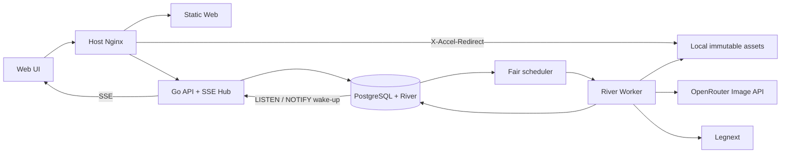
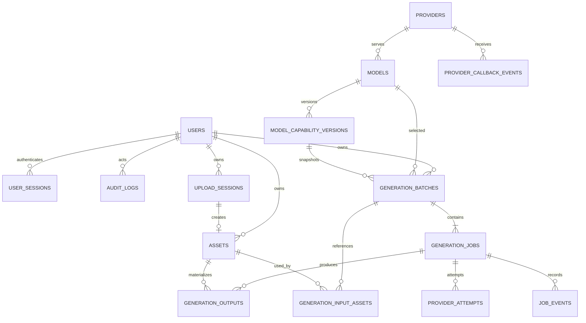

# 05 · MVP PRD 与数据库模型

## 1. 文档信息

| 项 | 内容 |
|---|---|
| 产品 | Internal Image Studio |
| 版本 | MVP / V1.0 Draft |
| 日期 | 2026-07-17 |
| 使用范围 | 公司内部 |
| 图片来源 | Legnext（Midjourney）+ OpenRouter（其他模型） |
| 核心原则 | 美感、低摩擦、高性能、能力驱动 |

## 2. 背景与问题

内部创作人员已经拥有多个官方/聚合模型 API 的访问能力，但缺少一个统一、稳定、适合连续创作的工作台。直接使用供应商页面会造成模型切换路径不一致、参数语义分裂、历史资产难以复用、多人并发任务不可观察等问题。

MVP 不试图成为商业化 AI 平台，而是建立一个高质量的内部“图片生成操作系统”：输入简单、反馈即时、历史结果自然沉淀，并能一键成为下一次生成的参考。

## 3. 产品目标

### 3.1 目标

- 在一个页面完成模型选择、提示词、参考图、比例、分辨率、抽卡次数与提交。
- 让生成结果持续进入美观、流畅、可缩放的瀑布墙。
- 让任意历史图片通过“参考、复制、下载”继续流动，而不是成为死资产。
- 用统一任务模型屏蔽 Legnext 异步 Job 与 OpenRouter Image API 的协议差异。
- 在供应商配额允许范围内承受内部突发并发，并保持 API/UI 可响应。
- 新增或调整模型时以能力协议为主，减少前端发版。

### 3.2 成功指标

产品指标不涉及收入或积分：

| 指标 | MVP 目标 |
|---|---:|
| 首次进入到首次成功提交的中位时间 | ≤ 60 秒 |
| 内部有效请求成功率（排除内容拒绝） | ≥ 98% |
| 供应商成功后资产入库成功率 | ≥ 99.9% |
| 历史图片“作为参考”复用率 | 上线后建立基线，持续观察 |
| 重复提交率（5 秒内相同参数） | < 0.5% |
| 前端崩溃/白屏率 | < 0.1% 会话 |

生成耗时按 provider/model 单独统计，不把供应商耗时计入本地 API SLO。

## 4. 非目标

MVP 明确不包含：

- 积分、充值、套餐、价格展示、账单、商业化限额。
- Draw、画布、蒙版、局部重绘、扩图、视频、Upscale、Enhance。
- 社区 Explore、公开分享、评论、点赞、关注。
- 团队空间、项目文件夹、审批、复杂 RBAC。
- 自建模型训练、LoRA 管理、提示词市场。
- 自动提示词改写、Agent 创作流程。
- 公开自助注册、邮件邀请/找回、MFA 与复杂身份联邦；V1 仍包含内部用户名密码、opaque session、首次改密和管理员账号管理。

## 5. 用户与场景

### 5.1 核心用户

- **设计/创意人员**：高频抽卡、对比多个模型和比例、复用参考图。
- **产品/运营人员**：快速制作概念图、活动图和提案素材。
- **管理员/开发者**：通过代码评审维护静态模型启停/能力配置，并在管理页只读检查供应商连接状态与 drift。

### 5.2 核心场景

1. 从文本快速生成一批不同构图的图片。
2. 用某张历史结果作为下一轮参考，延续主体或风格。
3. 同时发起多次抽卡，在生成过程中继续浏览和创作。
4. 从大量历史资产中找到图片并复制/下载。
5. 某个模型限流或失败时，清楚知道失败在哪一次抽卡并只重试失败项。

## 6. MVP 功能范围

### 6.1 P0 功能

| 模块 | 功能 | 验收摘要 |
|---|---|---|
| 生成器 | 提示词 | 支持多行、快捷提交、模型上限校验 |
| 生成器 | 模型 | 仅显示启用模型；能力标签和搜索 |
| 生成器 | 参数 | 比例、分辨率、抽卡 1～4，完全按能力渲染 |
| 生成器 | 参考图 | 本地上传或从历史图片添加；支持移除与上传状态 |
| 任务 | 异步批次 | 提交立即返回；多 draw 独立状态；部分成功可用 |
| 任务 | 原位占位与取消 | 每个预计输出即时占位；左上状态；右上按 draw 取消 |
| 灵感墙 | 瀑布流 | 最新资产在前；比例稳定；虚拟化；无限加载 |
| 灵感墙 | 缩放 | 180/240/320/420/560px 五档目标行高，偏好本地持久化并保持视口中心资产锚点 |
| 图片操作 | 参考 | 一键进入生成器并保留资产血缘 |
| 图片操作 | 复制 | 复制图片二进制；不支持时降级复制链接 |
| 图片操作 | 下载 | 鉴权后由 Nginx X-Accel-Redirect 下载本地不可变原图 |
| 图片预览 | 大图与元数据 | 展示提示词、模型、比例、尺寸、时间和三个动作 |
| 资产库 | 检索 | 提示词搜索，按模型/日期/比例筛选，游标分页 |
| 管理 | 模型 | 只读显示静态配置、能力 revision 与远端 drift；变更通过代码评审/部署 |
| 管理 | 供应商 | 配置状态、健康检查、最近错误；不展示完整 Key |
| 可观察性 | 状态与错误 | 任务抽屉、SSE 更新、规范化错误、request ID |

### 6.2 P1 候选，不进入首发阻塞项

- OpenRouter partial image 临时预览。
- 复制提示词、收藏、批量下载。
- 高级参数：seed、quality、透明背景等。
- 个人生成器参数云同步。
- 模型自动降级/智能 fallback。

## 7. 详细需求与验收标准

### FR-01 模型与参数

- 页面首次打开载入默认模型和能力。
- 模型切换后，比例、分辨率、参考图上限和预计输出数立即更新。
- UI 不展示当前模型不支持的参数。
- 能力版本变化导致提交冲突时，不丢失 prompt，用户确认新参数后可再次提交。

验收：管理员仅更新能力记录并发布后，生成器能出现一个新模型，无需修改生成页条件代码。

### FR-02 抽卡语义

- 用户选择的是 `抽卡次数`，不是模糊的图片数量。
- UI 必须同时展示预计图片数。
- Midjourney 若每次固定 4 张，则抽卡 3 次显示“预计 12 张”。
- 单批预计图片数不得超过 16。

验收：提交后批次包含正确 draw 数；单 draw 失败不影响同批成功图片。

### FR-03 参考图

- 上传通过同源 API 流式写入本地 quarantine；Nginx 关闭 request buffering，API 不把整文件读入内存。
- 文件必须通过 MIME/魔数、大小、像素和安全校验才可引用。
- 点击墙面“参考”在 100ms 内提供视觉反馈并滚动/聚焦生成器。
- 新输出记录所有参考资产 ID。

验收：从资产 A 参考生成 B，可在 B 的详情和数据库中反查 A。

### FR-04 任务反馈

- 创建请求成功后，100ms 内在本地 UI 插入占位卡。
- 占位卡插在墙面最前方，数量等于 `expected_outputs`，比例等于目标比例；原有资产自然重排。
- 占位卡左上显示排队/生成状态标识，右上显示取消按钮，卡面使用低对比柔光呼吸动效。
- 状态变化和成图必须在同一外框内原位替换，不能造成布局跳动。
- SSE 推送状态；SSE 断线时自动重连，并可通过 GET 恢复真相。
- 无可信上游进度时只显示不确定进度，不伪造数值。
- 失败文案可理解，并区分是否可重试。
- 取消以 draw 为最小真实单位：尚未提交则停止；上游不可取消时用户侧立即结束等待并丢弃迟到结果，同时在远端终态或“原 deadline + 有界观察宽限”前继续占用用户/Provider/模型并发，并明确提示可能仍有供应商消耗。正常超时前必须先做一次认证 final poll，恢复截止点前刚完成的已付费结果。
- 提交后 prompt、模型和参数继续保留，生成器不锁定，用户可开始下一批。

验收：刷新页面后，运行中任务和已完成输出能够恢复，不重复提交；取消一个多输出 draw 时，同属该 job 的全部占位卡同步进入取消态并收拢。

### FR-05 灵感墙

- 使用 justified rows 按图片真实比例横向拼行，完整行铺满容器；加载前已有宽高占位。
- 支持 0～4 五档墙面密度、无限加载和键盘方向键操作；改变密度不缩放导航、文字或生成器。
- 缩放重排时以视口中央资产为锚点，尽量保持其屏幕位置，避免用户失去浏览上下文。
- 桌面 hover 出现参考/复制/下载；触摸设备在预览层操作。
- 新完成图片插入墙面前部，但用户正在向下浏览时不强制跳回顶部；显示“有 N 张新图片”浮标。

验收：加载 2000 条资产数据时，墙面使用绝对定位 + 行级虚拟化，DOM 节点受控；连续滚动无明显长任务；改变密度后中央资产仍可见且没有大幅方向迷失。

### FR-06 资产可靠性

- 供应商结果完成下载/解码/校验，并原子提交到本地不可变资产树后才对用户宣布成功。
- 墙面使用衍生缩略图，下载使用原图。
- 资产 URL 不依赖 Legnext/OpenRouter 临时地址。

验收：模拟供应商 URL 在 1 小时后失效，历史资产仍可预览和下载。

## 8. 非功能需求

### 8.1 性能 SLO

基线压测场景：200 个活跃 SSE 会话、100 RPS 的 10 秒创建突发、2000 个排队 draw；供应商并发由配置限制。

| 指标 | 目标 |
|---|---:|
| `POST /generations` 本地处理 p95 | < 250ms |
| 资产/任务列表 API p95 | < 300ms |
| DB commit 到 SSE 可见 p95 | < 1s |
| 暖缓存模型列表 p95 | < 100ms |
| 首屏 20 张缩略图 LCP（公司网络） | < 2.0s |
| 墙面滚动 | 目标 60fps，p95 长任务 < 50ms |
| API 非供应商相关可用性 | ≥ 99.9% |

### 8.2 并发与背压

- API 层只做校验，并在同一事务写 batch/job/job_events；初始任务只进入业务表的 `queued` 状态，不直接调用上游或写 River 执行 job，不占用连接等待生成。
- V1 固定一个 Worker 容器：PostgreSQL advisory lock 保证单例公平调度器，River 提供延迟执行/重试/崩溃恢复，进程内有界 goroutine/信号量按 provider/model 控制 I/O 并发。确有多 Worker 需求后再引入数据库分布式信号量，不提前引入额外协调组件。
- 队列深度升高时仍接受到安全上限，返回准确 queued 状态和队列位置估计（P1 可展示）。
- 达到系统保护阈值时返回 503 `QUEUE_SATURATED`，不得让 PostgreSQL、Worker 或本地资产盘雪崩。
- 同一内部身份可配置同时运行 draw 上限，目的为公平调度，不是商业额度。
- 用户侧已 `cancelled` 或超时后已 `failed`、但仍存在 `upstream_active_until > now()` 的任务，继续计入用户、Provider 与模型并发；只有真实上游取消被接受、观察到远端终态或“原 generation deadline + 有界观察宽限”的硬截止到期才释放占用。观察宽限通常等于模型生成 timeout，最多 1 小时。

### 8.3 可靠性

- PostgreSQL 是任务、River 队列和可靠事件的事实来源；进程内缓存与 `LISTEN/NOTIFY` 通知均可丢失/重建，不能成为唯一状态存储。
- River 使用 lease/重试恢复崩溃中的执行，Worker 另向 `service_heartbeats` 写实例心跳；调度自修复会重新派发卡在 dispatched 且没有有效 River job 的任务。
- 状态更新在事务中锁定 job 并校验允许的来源状态；终态不可回退，迟到 callback 只能被记录/忽略，不能把任务改回 running。
- 状态更新与 `job_events` 插入在同一事务；触发器用 `pg_notify` 只发送 owner user ID 作为唤醒信号。通知丢失时 API/SSE 仍按事件 ID 从表中补读，事件表本身是唯一可靠事件源。
- 每个上游调用有 timeout、request ID 和结构化日志。

### 8.4 安全与隐私

- API Key 永不下发浏览器，不写数据库明文。
- prompt、参考图和输出默认是内部私有数据。
- 媒体访问使用内部鉴权或短期签名 URL。
- 管理操作写审计事件；供应商原始 payload 仅管理员/工程排障可见。
- 日志脱敏 API Key、Authorization、签名 URL query 和可能的 base64 图片。

### 8.5 可访问性

- 键盘可完成模型选择、参数设置、生成、预览和图片动作。
- 色彩对比满足 WCAG 2.1 AA；状态同时有文本/图标。
- 支持 reduced motion；图片有基于 prompt 截断生成的可访问描述。

## 9. 建议系统结构

建议 Go 作为 V1 后端：API、worker 和 provider adapter 共用类型定义，易于控制连接池、并发、内存和流式文件处理。前端与部署技术栈不在本 PRD 强制锁死。

## 10. 数据库模型

数据库采用 PostgreSQL。业务主键使用数据库生成 UUID，事件/attempt 使用递增 bigint；时间均为 `timestamptz`，状态字段以 CHECK 约束字符串表达。

### 10.1 ER 图

### 10.2 `users`、`user_sessions` 与 `audit_logs`

- `users`：UUID、唯一 `citext username`、display name、Argon2id hash、member/admin、active/disabled、首次改密/临时密码过期、`session_version`、创建者与登录/审计时间。禁止删除最后一个 active admin。
- `user_sessions`：只保存 256-bit opaque token 的 hash、CSRF hash、创建时 session version、UA/IP 的受限摘要、绝对/空闲过期与撤销时间；Cookie 明文 token 永不落库。
- `audit_logs`：递增 ID、actor、action、target、request ID、小型脱敏 metadata 与时间。管理员创建/停用/重置账号、撤销 session 和模糊提交对账必须写入。

### 10.3 `providers`

供应商连接元数据，不存 API Key。

| 字段 | 类型 | 说明 |
|---|---|---|
| `id` | `text PK` | `legnext` / `openrouter` |
| `display_name` | `text` | 展示名 |
| `enabled` | `boolean` | 是否接收新任务 |
| `state` | `text` | unknown/healthy/degraded/paused |
| `breaker_open_until` | `timestamptz NULL` | 熔断截止时间 |
| `last_probe_at` | `timestamptz NULL` | 最近非计费探测 |
| `last_error_code`,`last_error_at` | nullable | 最近规范化错误摘要 |
| `updated_at` | `timestamptz` | 时间 |

Provider key 只通过 Worker 的 file-backed secret 读取；表内不保存 key、末四位、base URL 或任意可用于恢复凭证的材料。并发、timeout、routing 与熔断阈值来自经过评审的静态模型配置。

### 10.4 `models`

| 字段 | 类型 | 说明 |
|---|---|---|
| `id` | `text PK` | 稳定 `model_id` |
| `provider_id` | `text FK` | 供应商 |
| `provider_model` | `text` | 上游模型名 |
| `display_name` | `text` | UI 文案 |
| `enabled` | `boolean` | 是否展示 |
| `sort_order` | `integer` | 排序 |
| `current_revision` | `text` | 当前 capability hash |
| `updated_at` | `timestamptz` | 时间 |

主键：`id`；索引：`(enabled, sort_order)`。

### 10.5 `model_capability_versions`

| 字段 | 类型 | 说明 |
|---|---|---|
| `model_id` | `text FK` | 模型 |
| `revision` | `text` | `modelctl apply` 生成的 capability hash |
| `config` | `jsonb` | 完整、不可变的模型能力与 Provider 映射快照 |
| `created_at` | `timestamptz` | 时间 |

主键：`(model_id, revision)`；`modelctl apply` 在同一事务插入快照并更新 `models.current_revision`，已存在 revision 的内容不得覆盖。

### 10.6 `generation_batches`

一次用户提交。

| 字段 | 类型 | 说明 |
|---|---|---|
| `id` | `uuid PK` | 批次 ID |
| `owner_user_id` | `uuid FK` | 当前登录用户；所有列表/详情按此隔离 |
| `idempotency_key` | `text` | 创建幂等键 |
| `request_hash` | `text` | 规范化请求 hash |
| `model_id` | `text FK` | 模型 |
| `capability_revision` | `text` | 提交时 capability hash，与 model 组成复合 FK |
| `prompt` | `text` | 原始 prompt |
| `aspect_ratio`,`resolution` | `text` | 已按能力快照校验的参数 |
| `draw_count` | `smallint` | 抽卡次数 |
| `expected_outputs` | `smallint` | 预计图片数 |
| `status` | `text` | queued/running/partial/succeeded/failed/cancelling/cancelled |
| `completed_outputs` | `smallint` | 已入库数量 |
| `created_at`,`updated_at` | `timestamptz` | 时间 |

约束/索引：

- `UNIQUE(owner_user_id, idempotency_key)`
- `CHECK(draw_count BETWEEN 1 AND 4)`
- `(owner_user_id, created_at DESC, id DESC)` 用于游标列表
- `(model_id, capability_revision)` 固定不可变能力快照

### 10.7 `generation_jobs`

一个 draw 对应一条记录。

| 字段 | 类型 | 说明 |
|---|---|---|
| `id` | `uuid PK` | Job ID |
| `batch_id` | `uuid FK` | 所属批次 |
| `owner_user_id` | `uuid FK` | 所属用户，用于公平调度与权限防御 |
| `draw_index` | `smallint` | 从 0 开始 |
| `status` | `text` | 规范化状态 |
| `dispatch_state` | `text` | pending/dispatched/finished |
| `river_job_id` | `bigint NULL` | River 执行 job |
| `provider_job_id` | `text NULL` | Legnext job_id 等 |
| `expected_outputs` | `smallint` | 此 draw 预计输出数 |
| `attempt_count` | `integer` | 已执行次数 |
| `error_code`,`error_message` | `text NULL` | 规范化错误 |
| `retryable` | `boolean` | 是否可重试 |
| `cancel_mode` | `text NULL` | local/requested_upstream/discard_result_only |
| `submission_uncertain` | `boolean` | 上游是否可能已接受但未拿到 ID |
| `next_attempt_at`,`generation_deadline` | `timestamptz` | 延迟重试与整次生成截止时间 |
| `upstream_active_until` | `timestamptz NULL` | 上游可能仍活动时的保守占用截止；用于 `cancelled`、超时且远端取消未被接受的 `failed`、`submission_uncertain`，以及已人工绑定 Provider job ID、正等待重派的 `queued` job |
| `execution_generation` | `integer` | 人工对账/重派代次，隔离陈旧 River 执行 |
| `dispatched_at`,`started_at`,`completed_at`,`created_at`,`updated_at` | `timestamptz` | 时间 |

约束/索引：

- `UNIQUE(batch_id, draw_index)`
- `(next_attempt_at, created_at) WHERE dispatch_state='pending'` 用于公平调度
- `(owner_user_id, status)` partial index 用于用户在途上限
- `(upstream_active_until) WHERE upstream_active_until IS NOT NULL` 用于恢复和释放取消/超时后的上游租约
- `CHECK(upstream_active_until IS NULL OR status IN ('cancelled','failed','submission_uncertain') OR (status='queued' AND provider_job_id IS NOT NULL))` 限制租约只出现在可恢复的保守占用状态

Provider 请求 ID、HTTP 状态、耗时、错误分类和 usage 不放在 job 大 JSON 中，而写入逐次不可变的 `provider_attempts`；OpenRouter 的同步结果和 Legnext 的远端 job ID 都遵循“拿到 Provider ID 后不重新 Submit”。

取消/超时后的并发语义与用户可见状态解耦：不支持可靠远端取消的 job 会尽快变为 `cancelled`；到达 generation deadline 时，Worker 先做一次最长 45 秒的认证 final poll，只有结果仍非终态且远端取消未被接受时才写为 `failed/PROVIDER_TIMEOUT`。这两类任务在 `upstream_active_until` 到期或观察到远端终态前，仍计入每用户、Provider 与模型的在途并发；硬截止为原 generation deadline 加有界观察宽限，宽限通常等于模型生成 timeout，最多 1 小时。River 对可轮询远端任务每 3 秒观察一次，远端终态会提前释放租约；取消任务的迟到结果丢弃，超时失败任务也不会从业务终态恢复为成功。真正被 Provider 接受的取消和提交前本地取消不保留租约。模糊提交也使用同一字段记录“远端可能仍活动”的硬截止；人工绑定远端 ID 后，租约随 queued job 保留到安全重派。该持久化字段使 Worker/数据库重启后仍能恢复保守占用，防止取消、超时或对账绕过并发限制。

### 10.8 `provider_attempts`

| 字段 | 类型 | 说明 |
|---|---|---|
| `id` | `bigserial PK` | 尝试 ID |
| `job_id` | `uuid FK` | 所属 draw |
| `provider_id` | `text FK` | Provider |
| `operation` | `text` | submit/poll/cancel/download 等 |
| `attempt_no` | `integer` | 同 operation 的尝试序号 |
| `provider_request_id` | `text NULL` | 经过长度/控制字符清理的上游请求 ID |
| `http_status`,`duration_ms` | `integer NULL` | 上游响应与耗时 |
| `outcome` | `text` | succeeded/failed；是否模糊提交由 job 状态单独表达 |
| `error_code`,`error_message` | `text NULL` | 规范化、脱敏错误 |
| `usage` | `jsonb` | 上游用量/成本与 mock 验证摘要，不形成用户计费 |
| `created_at` | `timestamptz` | 时间 |

唯一约束：`(job_id, operation, attempt_no)`。

### 10.9 `assets`

用户上传参考图和生成图片共用资产表。

| 字段 | 类型 | 说明 |
|---|---|---|
| `id` | `uuid PK` | 资产 ID |
| `owner_user_id` | `uuid FK` | 创建者 |
| `kind` | `text` | upload/generation |
| `storage_key` | `text` | 本地资产根下的逻辑相对路径，不存绝对路径 |
| `mime_type` | `text` | 验证后的格式 |
| `original_filename` | `text NULL` | 仅上传资产可有的安全显示名 |
| `byte_size` | `bigint` | 文件大小 |
| `width`,`height` | `integer` | 像素尺寸 |
| `sha256` | `text` | 内容 hash |
| `blur_data_url` | `text NULL` | 低清占位，不含原图字节 |
| `expires_at`,`purge_pending`,`purged_at` | mixed | 90 天保留与两阶段清理 |
| `created_at` | `timestamptz` | 时间 |

索引：

- `(owner_user_id, created_at DESC, id DESC) WHERE purged_at IS NULL`：资产墙游标分页
- `(owner_user_id, sha256) WHERE purged_at IS NULL`：当前用户内容去重
- `(expires_at) WHERE purged_at IS NULL`：维护清理

### 10.10 `generation_input_assets`

| 字段 | 类型 | 说明 |
|---|---|---|
| `batch_id` | `uuid FK` | 生成批次 |
| `asset_id` | `uuid FK` | 参考资产 |
| `position` | `smallint` | 参考图顺序 |

主键：`(batch_id, asset_id)`；`position` 保留参考图顺序。

### 10.11 `generation_outputs`

| 字段 | 类型 | 说明 |
|---|---|---|
| `job_id` | `uuid FK` | 来源 draw |
| `asset_id` | `uuid FK UNIQUE` | 生成资产 |
| `output_index` | `smallint` | 上游输出顺序 |

主键：`(job_id, output_index)`，`asset_id` 唯一。该表和 `generation_input_assets` 共同形成生成血缘。

### 10.12 `upload_sessions`

| 字段 | 类型 | 说明 |
|---|---|---|
| `id` | `uuid PK` | upload_id |
| `owner_user_id` | `uuid FK` | 创建者 |
| `original_filename` | `text` | 清理后的显示名 |
| `declared_media_type`,`declared_size` | mixed | 创建 session 时声明的格式与字节数 |
| `status` | `text` | created/uploading/validating/ready/failed/expired |
| `quarantine_key` | `text NULL` | quarantine 中的系统生成文件名 |
| `asset_id` | `uuid FK NULL` | 校验完成后的正式资产 |
| `error_code` | `text NULL` | 规范化失败原因 |
| `expires_at`,`created_at`,`updated_at` | `timestamptz` | 时间 |

### 10.13 `job_events` 与 PostgreSQL 通知

| 字段 | 类型 | 说明 |
|---|---|---|
| `id` | `bigserial PK` | 全局递增事件游标；同一用户按此单调重放 |
| `owner_user_id` | `uuid FK` | 事件所属用户与 SSE 隔离键 |
| `job_id`,`batch_id` | `uuid` | 聚合对象 |
| `event_type` | `text` | 状态/资产/错误事件 |
| `payload` | `jsonb` | 小型事件数据 |
| `created_at` | `timestamptz` | 时间 |

状态更新与事件插入同一事务；insert trigger 调用 `pg_notify('job_events', owner_user_id)`，通知只负责唤醒 API，不携带 prompt 或任务详情。PostgreSQL 在事务提交后才投递通知；API 收到后按 `(owner_user_id, id)` 查询增量事件。通知丢失、API 重启或 SSE 重连都不会丢业务状态，客户端使用 `Last-Event-ID` 补读；事件当前保留 90 天，过期后客户端重新查询 batch/asset 快照。不存在独立事件发布进程或发送状态。

### 10.14 `provider_callback_events`

| 字段 | 类型 | 说明 |
|---|---|---|
| `id` | `bigserial PK` | 内部事件 ID |
| `provider_id` | `text FK` | Legnext 等 |
| `event_hash` | `text` | Provider + 规范化事件去重键 |
| `provider_job_id` | `text NULL` | 可解析时记录 |
| `payload` | `jsonb` | 大小受限、去除未知字段后的规范化最小事件 |
| `created_at`,`processed_at` | `timestamptz` | 时间 |

唯一约束：`(provider_id, event_hash)`。Callback body 上限 64 KiB，只接受能关联到时间窗口内非终态任务的事件，并限制每个 job 的事件数量；callback 只唤醒/加速认证查询对账，未通过服务端回查的 payload 不改变任务终态。

## 11. 数据一致性规则

1. 创建批次、创建所有 job、写首个 `job_events` 事件和 Idempotency-Key 记录必须在同一事务完成；River job 由公平调度器后续通过 `InsertTx` 原子派发。
2. 本地资产完成校验并原子 rename 后，在事务中将 asset 置 ready、插入 output、递增批次计数；资产保存失败只重试入库，不重新调用 Provider。
3. `completed_outputs` 是可重算的缓存计数；定时一致性任务可修复。
4. Job 终态不可回退；状态写入在事务中锁行并验证允许的来源状态，重复/乱序事件保持幂等。
5. 删除/过期不在 MVP UI，但本地文件清理必须先确认没有 input/output/staged 引用。
6. 供应商 callback、轮询和 worker 重试都必须通过同一幂等状态转移函数。

## 12. 缓存与分页

- 模型列表：API 按 capability hash 缓存在有界进程内结构中直至重启，并返回 ETag；模型变更只通过静态配置、`modelctl apply` 与部署完成。
- 资产墙：Keyset pagination，游标包含 `(created_at, id)`；禁止深 offset。
- 缩略图：使用内容 hash/ETag 与浏览器私有 immutable cache；Nginx `sendfile` 和 Linux page cache 服务热门文件。受保护资产不进入公共 proxy/CDN cache，原图经授权后由 `X-Accel-Redirect` 直出。
- Session、任务热快照和资产第一页可放入 Go 有界 TTL cache；数据库通知只做精确失效/唤醒，PostgreSQL 始终可以恢复全部状态。
- 不缓存带完整 prompt 的公共响应；静态 hash 资源可缓存一年，私有缩略图可缓存一天。
- V1 不部署外部分布式缓存、公共 CDN、PgBouncer 或独立 S3 服务；缓存命中率不能改变权限、状态机或事件重放结果。

## 13. 可观察性

### 指标

- `image_studio_http_requests_total{method,status}` 与 `image_studio_http_request_duration_seconds`
- `image_studio_generation_jobs{status}` 与 `image_studio_queue_oldest_seconds`
- `image_studio_asset_disk_free_percent`
- `image_studio_provider_state`、`image_studio_provider_enabled`、`image_studio_provider_breaker_open`、`image_studio_provider_attempts_5m{provider,outcome}`
- `image_studio_sse_connections`；DB commit 到客户端送达的端到端延迟在 V1 由 canary/负载测试验收，当前没有服务端 histogram
- `image_studio_upload_sessions`、`image_studio_upload_reserved_bytes`
- `image_studio_db_connections{state}` 与 `image_studio_service_heartbeat_age_seconds{service}`

### 日志与追踪

结构化日志使用 `batch_id`、`job_id`、`provider_request_id`/`provider_job_id` 关联一次任务；日志不包含 Key、完整签名 URL、callback body、prompt 或 base64。V1 未部署分布式 tracing backend，不能把尚未采集的 trace/span 当作上线诊断手段。

### 告警

- 10 分钟供应商有效成功率 < 90%。
- 队列最老任务等待超过阈值。
- 资产入库失败连续发生。
- API p95/SSE lag 超 SLO。
- 供应商鉴权或额度错误出现 1 次即通知管理员，但对普通用户只显示系统连接异常。

## 14. 风险与处理

| 风险 | 影响 | 处理 |
|---|---|---|
| 模型能力频繁变化 | UI 可选但提交失败 | 版本化能力、endpoint 交集、发布审核、冒烟测试 |
| Midjourney 输出语义特殊 | 抽卡次数与图片数混淆 | 明确 `draw_count` 和预计输出数 |
| Legnext callback 无可靠签名说明 | 伪造状态 | 不可猜 token + 限流 + API 回查为真相 |
| 供应商图片 URL 过期 | 历史资产丢失 | 完成后立即复制到本地不可变资产树并生成缩略图 |
| OpenRouter base64 占内存 | Worker OOM | 响应 160 MiB/单图 50 MiB 硬上限、独立 Worker 内存预算、解码后立即 staged；V1 不宣称零拷贝 |
| 超时后盲目重试 | 重复生成/额度消耗 | 持久化 provider_job_id、幂等状态机、人工可见异常 |
| 瀑布墙图片过多 | 卡顿/布局抖动 | 服务端尺寸、虚拟化、缩略图、keyset pagination |
| 剪贴板浏览器差异 | 复制失败 | 二进制复制优先，链接复制/下载降级 |

## 15. 发布门槛

上线前必须完成：

- Legnext 与每个启用 OpenRouter 模型的最小能力矩阵冒烟测试。
- 文生图、图生图、1～4 抽卡、部分失败、重试、刷新恢复端到端测试。
- 供应商 429/5xx/超时/鉴权/额度不足故障注入。
- 200 会话 + 创建突发 + 2000 排队 draw 的本地链路压测。
- 2000 资产墙滚动、缩放、图片完成插入的浏览器性能测试。
- API Key/签名 URL/base64 不进入浏览器日志与服务端普通日志的安全检查。
- 本地资产盘只读/空间阈值、Worker 崩溃、SSE 重连和 callback 重复到达的恢复测试。

## 16. 建议实施切片

1. **契约切片**：能力协议、数据库迁移、统一 API mock、生成页静态高保真。
2. **OpenRouter 纵切**：单模型文生图 → 本地不可变资产 → 墙面 → X-Accel 下载。
3. **Legnext 纵切**：异步提交/轮询/callback → 4 图入库 → 批次状态。
4. **图生图闭环**：上传、历史参考、血缘、能力校验。
5. **并发与质量**：队列、限流、SSE、虚拟化、故障注入、压测。
6. **内部试用**：小流量模型白名单，收集抽卡语义、墙面密度和复制体验反馈。
